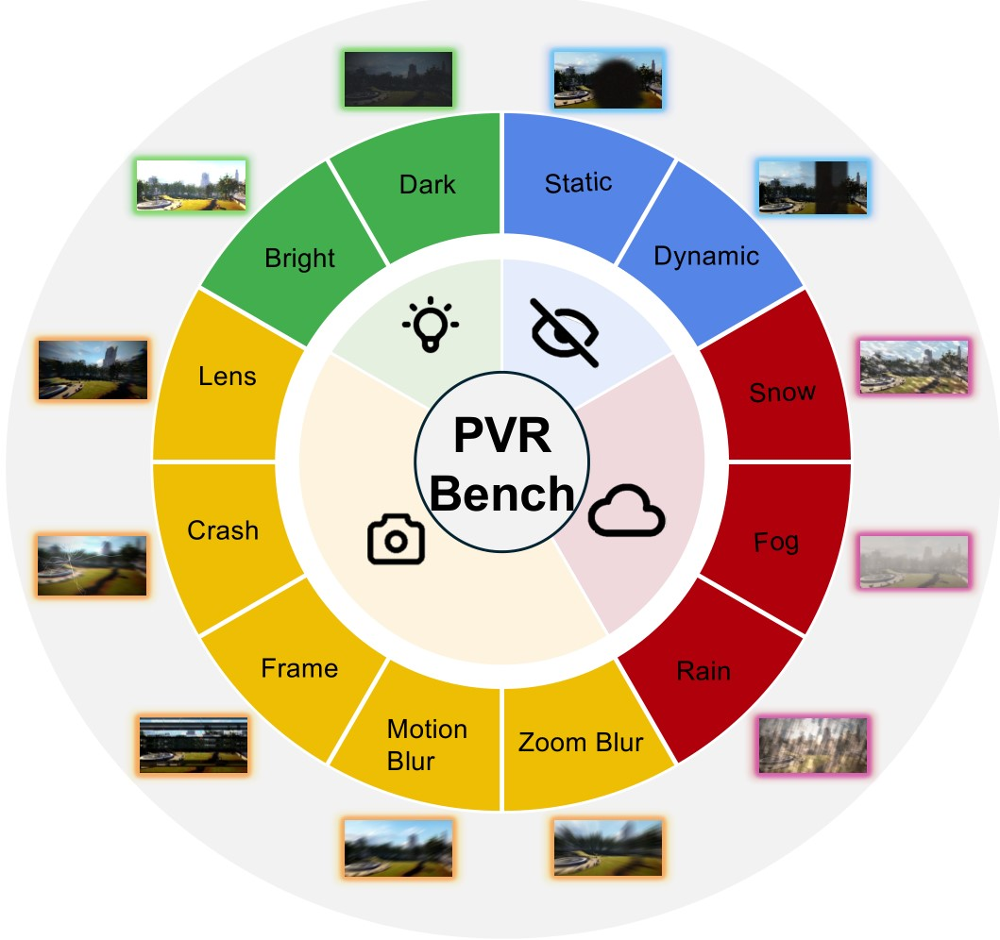
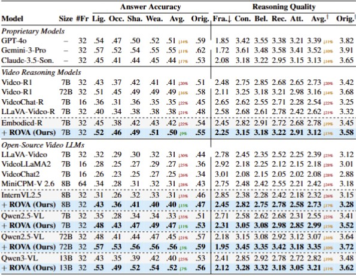

# ROVA: Robust Video Alignment for Video Reasoning

## About

This repository provides the training and evaluation code for robust video reasoning with vision-language models. The framework incorporates structured spatio-temporal corruption, self-reflective difficulty-aware training, and dual-branch alignment optimization to improve robustness under realistic visual disturbances.

## Features

+ Support Qwen2.5-VL
+ Support vLLM training and inference
+ Support Image-Video mixed training
+ Support multiple types for answers output (multiple choice, numerical, OCR, free-form, regression)
+ Provide full pipeline (dataset, COT annotation, SFT training, RL training, evaluation, etc)

## Dataset

To overcome the scarcity of high-quality video reasoning training data, we strategically introduce image-based reasoning data as part of training data. We collect data from a variety of public datasets and carefully sample and balance the proportion of each subset.

<div style="text-align: center;">
    
</div>

To facilitate an effective SFT cold start, we leverage Qwen2.5-VL-72B to generate COT rationales for the training samples. After applying basic rule-based filtering to remove low-quality or inconsistent outputs, we obtain a high-quality CoT dataset.

## Performance
The model significantly outperforms previous models across most benchmarks, achieving strong performance on video spatial reasoning and other video understanding tasks.

<div align="center">
  
</div>

Besides, although the model is trained using only 16 frames, we find that evaluating on more frames (e.g., 64) generally leads to better performance, particularly on benchmarks with longer videos. These results indicate the importance of training models to reason over more frames.

## RL Training Curves

The accuracy reward exhibits a generally upward trend, indicating that the model continuously improves its ability to produce correct answers under RL.

Interestingly, the response length curve first drops at the beginning of RL training, then gradually increases. We guess this is because the model initially discards its previous, potentially sub-optimal reasoning style. Then gradually converges to a better and stable reasoning policy.


## Set up

```bash
# build environment
conda create -n rova python=3.11 
conda activate rova
bash setup.sh

# qwen video extraction setting, e.g., max frames, resolutions
# Use the [decord] feature to improve speed
cd src/qwen-vl-utils
pip install -e .[decord]
cd ..
```

Please put the downloaded dataset to `src/r1-v/data/`

Then, unzip the data

```
python ./src/unzip.py
```

Qwen2.5-VL has been frequently updated in the Transformers library, which may cause version-related bugs or inconsistencies.

Then install the provided version of transformers

```bash
unzip transformers-main.zip
cd ./transformers-main
pip install .
```

For vLLM library, please use 0.7.2 version.

For trl library, please use 0.16.0 version.

## Training

We first perform supervised fine-tuning on the COT dataset for one epoch. If you want to perform CoT annotation on your own data, please refer to `src/generate_cot_vllm.py`

```bash
bash ./src/scripts/run_sft_video.sh
```

This is followed by RL training on the dataset to produce the final model. The script for training with GRPO is as follows:

```bash
bash ./src/scripts/run_grpo_video.sh
```

You can also use the following script to enable vLLM acceleration for RL training

```bash
bash ./src/scripts/run_grpo_vllm_qwen25vl.sh
```

For efficiency considerations, we limit the maximum number of video frames to 16 during training. Each frame is processed at a max resolution of 128 × 28 × 28. You can set this in `src/qwen-vl-utils`

Please keep per_device_train_batch_size=1 as in previous work r1-v

## Inference & Evaluation

During inference, we increase the max frame resolution to 256 × 28 × 28 and max frames to 16/32/64 to enhance performance. You can easily set this in `src/qwen-vl-utils`

For all evaluations, we follow the decoding configuration used in the official Qwen2.5-VL demo, with top\_p = 0.001 and temperature = 0.01. Setting large top_p may encounter messy output when inference.

We recommend using the provided json files and scripts for easier evaluation.

Put evaluation files in `/src/r1-v/Evaluation`

Next, download the evaluation video data from each benchmark's official website, and place them in `/src/r1-v/Evaluation` as specified in the provided json files.

Finally, conduct evaluation on all benchmarks using the following scripts

```bash
bash ./src/eval_bench.sh
```
For inference on a single example, you may use:

```bash
python ./src/inference_example.py
```

## Acknowledgements

We sincerely appreciate the contributions of the open-source community.
